# Projects/Works

## Table of Contents

- [U.S. Census Bureau](#us-census-bureau)
- [BetaNYC](#betanyc)
- [American Geographical Society](#american-geographical-society)
- [DCP and DOT](#nyc-department-of-city-planning-and-nyc-department-of-transportation)
- [School work](#school-work)

---

## Hobbies and volunteer work

- Super Steward for NYC Parks; and [Queens Community Board 7 member](https://www.nyc.gov/site/queenscb7/index.page)

- Manage the ETL process for [deidentified NYC Housing Court Filings data](https://github.com/housing-data-coalition/oca?tab=readme-ov-file) that feed in to the [Housing Data Coalition's nycdb](https://www.housingdatanyc.org/) and Right to Counsel NYC Coalition tools.

- Maintaining scripts for open datasets that should be cataloged by agencies. [MTA Shapefiles](https://github.com/zhik/MTA-Mass-Transit/releases), [up to date school points](https://github.com/zhik/nyc-half-open-data/blob/main/school%20locations%20and%20demographics.ipynb)

## U.S. Census Bureau

Building web interfaces, API backends, and data pipelines to streamline Group Quarters enumeration in preparation for 2030 Census; and rebuilding tools for the public to interact with economic data on business and employees.

## BetaNYC

Maintained and created civic tools using data, design and technology to amplify urban issues in tangible and accessible ways.

- [Boundaries Map](https://boundaries.beta.nyc/)
- [Geocoder.nyc](https://www.geocoder.nyc/)
- Assisted in the [NYC Urban Heat Portal](https://urbanheat.nyc/)

Assisted community groups and elected offices in over 200 [research and data projects](https://www.beta.nyc/featured-tools/research-and-data-assistance-requests/).

- Community Board appointment process and demographics - Redesigned and implemented the appointment process used by all the borough presidents. 
- Community Board Database - tools and training for community boards to organize administrative information and track their district’s responsibilities.

- [CC33 Tree Map](https://treemap.lincolnrestler.nyc/)
- [Get Local East Village](https://getlocalev.com/) - A map directory of local independent businesses in the East Village NYC; and database that helped with the analysis in [Storefront Trends in the East Village, 2019–2021](https://www.evccnyc.org/wp-content/uploads/2023/05/Crisis-and-Adaptation-East-Village-Storefront-Survey.pdf) 
- [Topographic Address Assignment Database](https://www.beta.nyc/featured-tools/topo-addresses-db/)

## American Geographical Society

Created dynamic and interactive publications for FOCUS on Geography, a publication of the American Geographical Society.

Here some of the articles that I worked on:

- [Lifeways and currents of change in the Peruvian Amazon: A 1000 km boat journey down the Ucayali River. Abizaid, Coomes, Takasaki](https://www.focusongeography.org/publications/articles/ucayali/index.html)

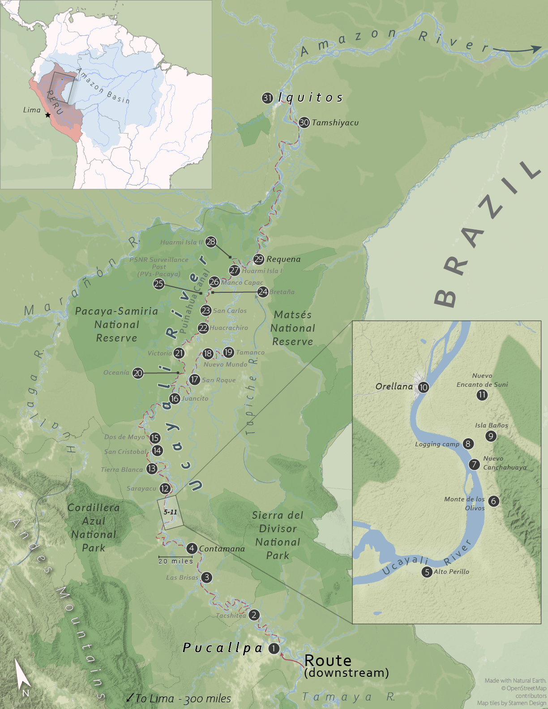

- [Street Art in Baltimore: A Catalyst for Change](http://www.focusongeography.org/publications/articles/baltimore/index.html)

## NYC Department of City Planning and NYC Department Of Transportation

Worked on various projects that aided in the collection, and maintenance of GIS data. Built web tools to visualize and help with research.

### 2019 - Web Batch Geocoder [Python, Javascript]

- Using Geosupport to make a web interface for easy geocoding of large speadsheets.
- View and correct for Geocoding errors.
- View results in leafet and export as shapefiles.

### 2018 - QGIS 3 Cyclomedia Plugin [Python]

- A Qgis 3 plugin for browsing Cyclomedia street view and tagging features

### 2018 - Select By Bounds Widget in ArcGIS Web AppBuilder [Javascript]

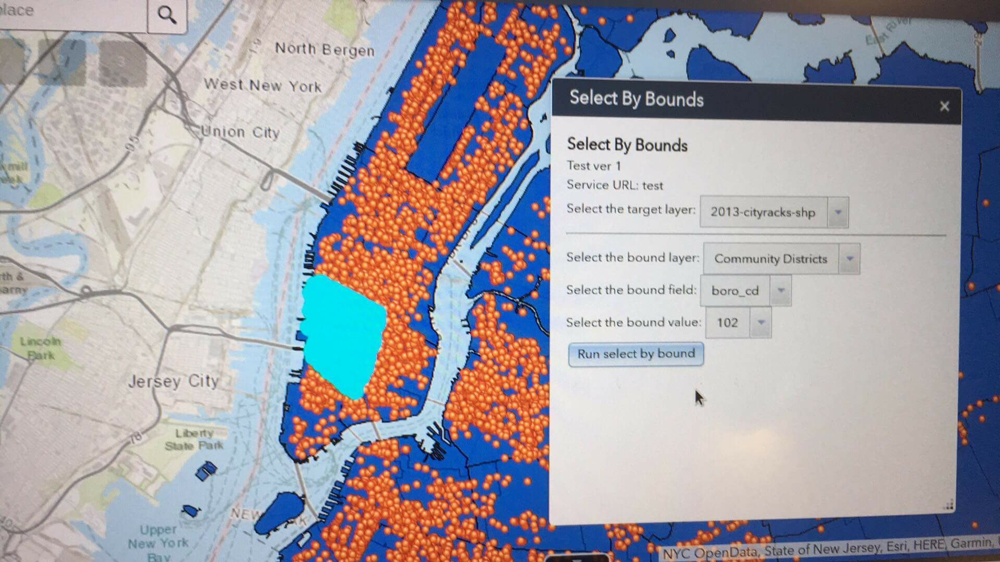

- Custom widget that will select by location on the target layer based on a select by attribute of the (source) bound layer.
- Does not use any credits.

### 2018 - Print Preview with OpenLayers [Javascript]

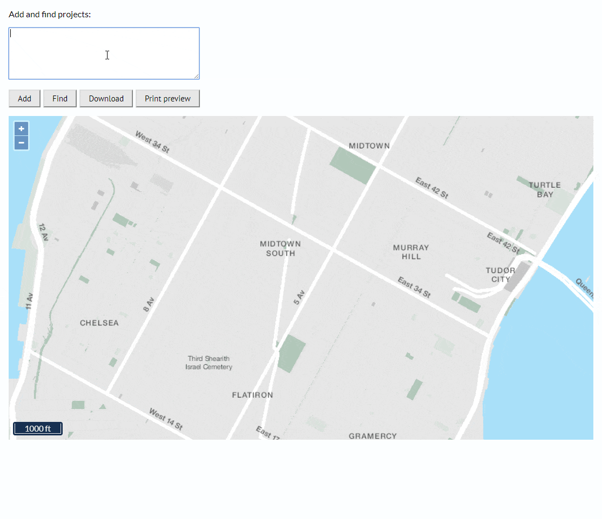

- Rotation of page
- Map adjustments in preview window

### 2018 - SIP Project viewer [Javascript]

- Using Mapbox and chart.js to display queried data from GeoServer.
- Includes different views for other projects.

### 2017 - Roadway Deterioration Prediction [Python, R, SQL, Javascript]

- Processing and generating datasets from ArcSDE using python (arcpy and pandas)
- Assisting in building a GWR model in R
- Displaying the model using Leaflet and D3.js

> 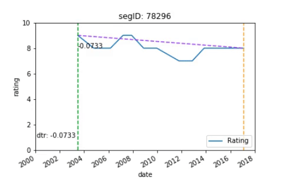

> ex: estimation of the average rate of deterioration from historical data (matplotlib)

> 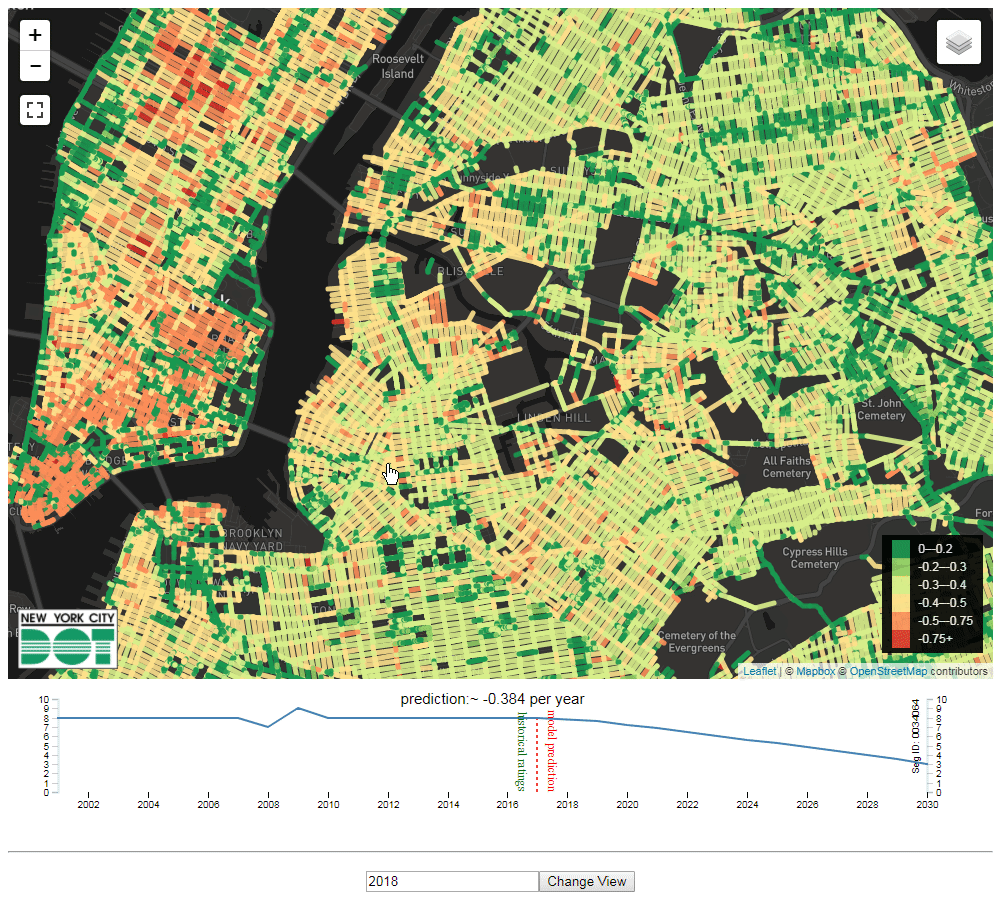

> ex: web view of the prediction and historical ratings

### 2017 - Python Script Catalog and Metadata [Sqlite, Python-Flask]

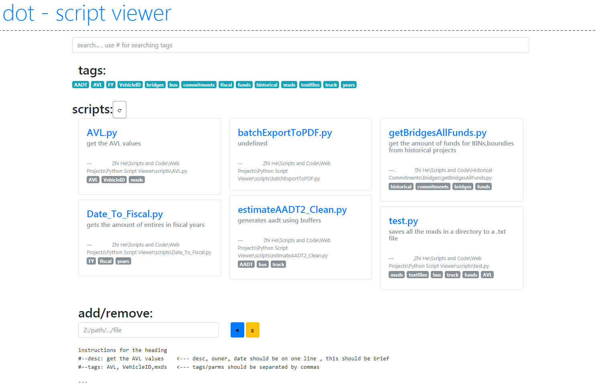 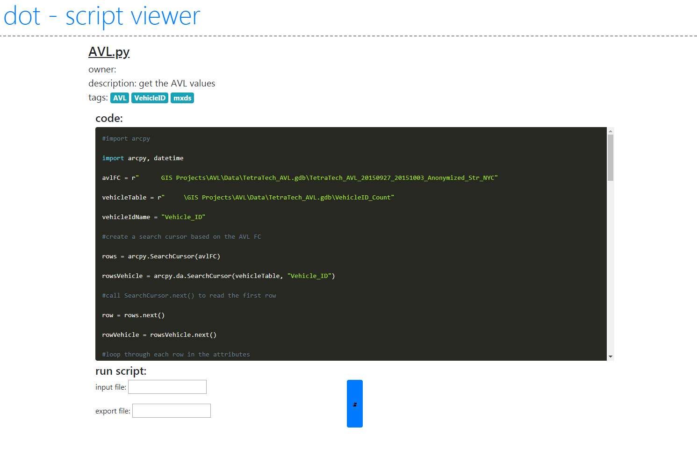

- Catalogs various scripts for quick searches based on functions, and tags.
- Run scripts using shell processes with parameters from form input.

## 2016 - Zero Bin Project

With other college aids, worked on evaluating and assigning BIN (Building Identification Numbers) in the Property Address Directory (PAD) to those missing them. Improve the quality of Primary Land Use Tax Lot Output (PLUTO). Built scripts and a web tool to link out to various research sources.

---

## School work

<!-- ### [A snapshot of New York City’s distribution of community gardens and funding resources](pdfs/cg.pdf)

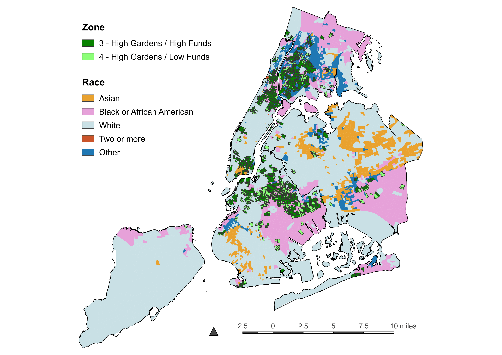

- Where NYC Department of Parks & Recreation capital funding and community gardens are, in comparison to demographic factors -->

### 2018 - Vegetation Index Visualization in the Sahara Desert [PostGIS, Nodejs-Express, Javascript]

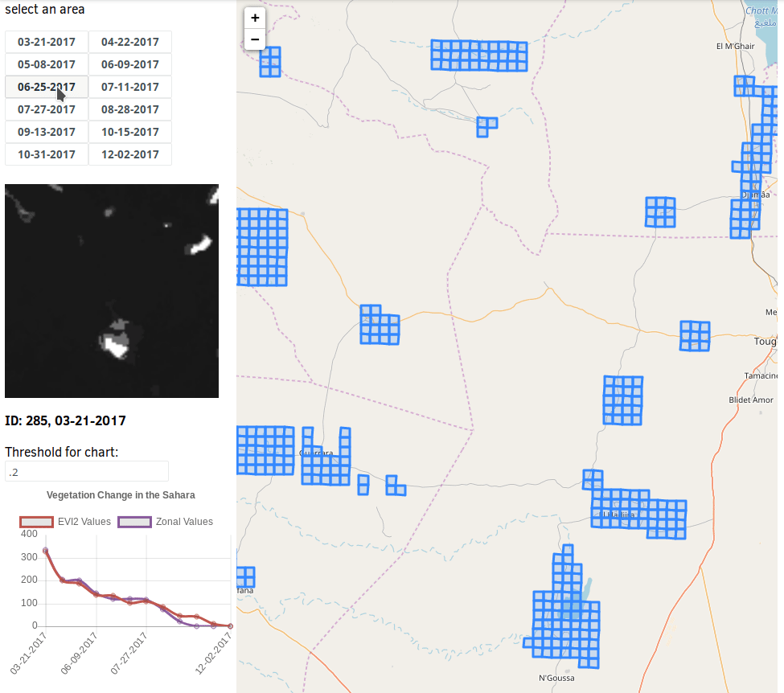

- Using python to gather imagery, selecting areas of interest
- Calculating EVI2 using PostGIS
- Serving time series images and graph data using Leaflet and Chart.js

### 2018 - Crowdsourcing mixed pixels to aid in spectral unmixing [PostGIS, Python-Flask, Javascript]

<!-- 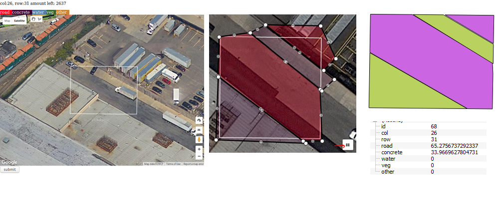 -->

- Dividing remotely sensed imagery into smaller areas using python, store on PostGIS database
- Serve areas to users, using Google maps API display and take crowdsourced material polygons
- Process material polygons to percentages for ground truthing in python and PostGIS

### 2017 - [Determining the optimal route for a Cross-Queens canal](pdfs/canal.pdf)

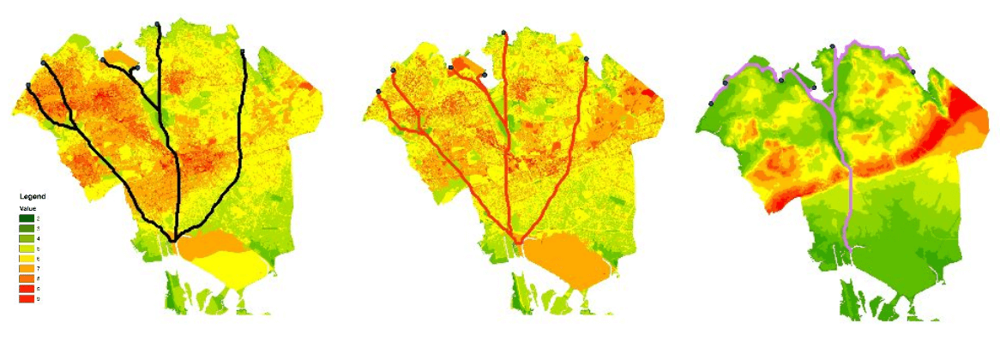

- Using raster least-cost path, on different scenarios and datasets (DEM, bus/subway, land use, FAR, Roadbed)

### 2016 - [Bandmath](https://github.com/zhik/bandmath) [Python]

<!-- 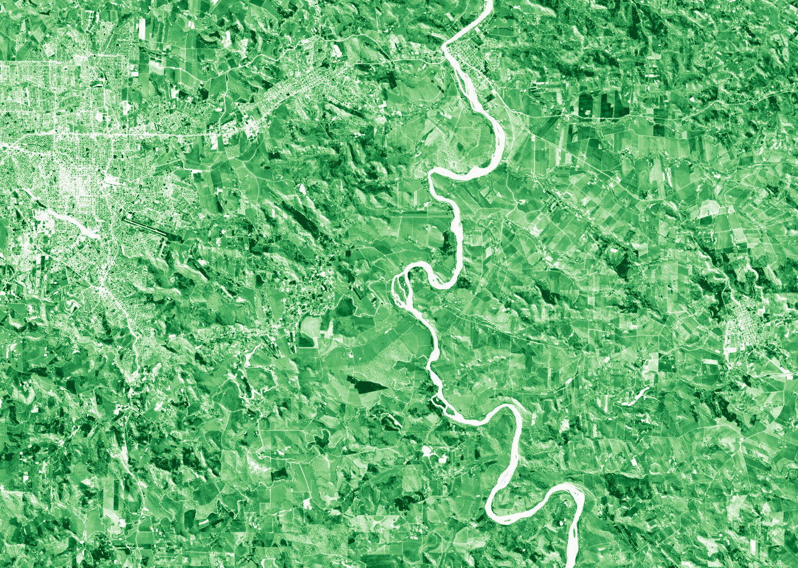 -->

- automating band math with gdal
- creating time lapse with images
