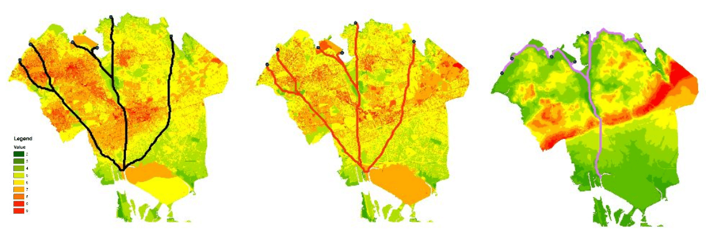

# Projects/Works

----------------

## NYCDOT

### Web Batch Geocoder [Python, Javascript]

* Using Geosupport to make a web interface for easy geocoding of large speadsheets.
* View and correct for Geocoding errors.
* View results in leafet and export as shapefiles.

### QGIS 3 Cyclomedia Plugin [Python]

* A Qgis 3 plugin for browsing Cyclomedia street view and tagging features

### Print Preview with OpenLayers [Javascript]

* rotation of page
* map adjustments in preview window

### SIP Project viewer [Javascript]

* Using Mapbox and chart.js to display queried data from GeoServer.
* Includes different views for other projects.

### Roadway Deterioration Prediction [Python, R, SQL, Javascript]

* Processing and generating datasets from ArcSDE using python (arcpy and pandas)
* Assisting in building a GWR model in R
* Displaying the model using Leaflet and D3.js

> 

> ex: estimation of the average rate of deterioration from historical data (matplotlib)

> 

> ex: web view of the prediction and historical ratings 

### Python Script Catalog and Remote use [Sqlite, Python-Flask]
<!--   -->

* Catalogs various scripts for quick searches based on functions, and tags.
* Run scripts using shell processes with parameters from form input.  

----------------

## Remote Sensing

### Vegetation Index Visualization in the Sahara Desert [PostGIS, Nodejs-Express, Javascript]

* Using python to gather imagery, selecting areas of interest
* Calculating EVI2 using PostGIS
* Serving time series images and graph data using Leaflet and Chart.js

### Crowdsourcing mixed pixels to aid in spectral unmixing [PostGIS, Python-Flask, Javascript]
<!--  -->
* Dividing remotely sensed imagery into smaller areas using python, store on PostGIS database
* Serve areas to users, using Google maps API display and take crowdsourced material polygons
* Process material polygons to percentages for ground truthing in python and PostGIS

### [Bandmath](https://github.com/zhik/bandmath) [Python]
<!--  -->
* automating band math with gdal
* creating time lapse with images

----------------

## GIS

### [A snapshot of New York City’s distribution of community gardens and funding resources](pdfs/cg.pdf)

* Where NYC Department of Parks & Recreation capital funding and community gardens are, in comparison to demographic factors

### [Determining the optimal route for a Cross-Queens canal](pdfs/canal.pdf)

* Using raster least-cost path, on different senerios and datasets (DEM, bus/subway, landuse, FAR, Roadbed)

----------------
## Hackathons

updating ... 